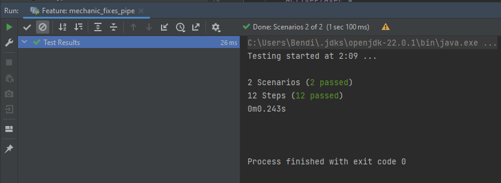

**
# BDD DOKUMENTÁCIÓ
**

## A feladat részei

A feladatot három fázisra osztottam fel:

1. A tesztelendő funkciók meghatározása
2. A tesztelendő funkciók specifikációja a BDD szabályai szerint
3. A specifikált esetek implementálása

## Tesztelendő funkciók

Teszteseteknek nyolc olyan alapvető funckiót választottam, amelyek helyes működése a játék szempontjából igencsak fontos/alapvető/elengedhetetlen. Ezek vegyes komplexitásúak: vannak köztük igazán egyszerűek (pl. passzolás), de olyanok is, ahol akár 3-4 forgatókönyv is előállhat (mozgás, pumpa összeszedése). A fő aktorok is igen változatosak: *Mechanic, Saboteur, Player, Cistern* és *Pump* fókuszú tesztek is megtalálhatóak a választott funkciók között.

**

1. Mechanic standing on a punctured pipe attempts to fix it
2. Player passes their turn
3. Player standing on a pipe attempts to puncture it
4. Cistern attempts to generate a pump
5. Mechanic attempts to collect a pump from a cistern
6. Saboteur standing on a pipe attempts to make it slippery
7. A pump experiences a breakdown
8. Player attempts to move from a pipe to one of its neighbouring components

## Tesztek specifikációja

A tesztek specifikációja a BDD szabványt követi. Egy címmel (*Title*) kezdődik, majd a fő aktor és a teszt céljának bemutatása következik (*As a, I want, so that*). Ezután a különböző esetek (*Scenario*) leírása következik. Itt először megadjuk az előfeltételeket (*Given, and*), majd a cselekvést (*when*), végül pedig az elvárt eredményt (*then*).

**

**Title: Mechanic standing on a punctured pipe attempts to fix it.**

    As a Mechanic,
    I want to be able to fix punctured pipes while standing on them,
    so that they become functional again.

**Scenario 1:** A Mechanic with enough AP fixes a punctured pipe while standing on it.

    Given that a pipe has been punctured
    and I am a Mechanic
    and I am standing on the pipe
    and I have enough AP,
    when I fix the pipe,
    then it should be functional again.

**Scenario 2:** A Mechanic without enough AP attempts to fix a punctured pipe while standing on it.

    Given that a pipe has been punctured
    and I am a Mechanic
    and I am standing on the pipe
    and I don't have enough AP,
    when I try to fix the pipe,
    then the pipe shouldn't be fixed.

---

**Title: Player passes their turn.**

    As a Player,
    I want to be able to pass my turn,
    so that my turn ends and the next player can start theirs.

**Scenario 1:** A Player passes their turn.

    Given that I am the active player,
    when I pass my turn,
    then my turn should be over.

---

**Title: Player standing on a pipe attempts to puncture it.**

    As a Player,
    I want to be able to puncture pipes while standing on them,
    so that they become non-functional.

**Scenario 1:** A Player with enough AP punctures a working pipe while standing on it.

    Given that a pipe is working
    and I am standing on the pipe
    and I have enough AP,
    when I puncture the pipe,
    then it should be punctured.

**Scenario 2:** A Player without enough AP attempts to puncture a working pipe while standing on it.

    Given that a pipe is working
    and I am standing on the pipe
    and I don't have enough AP,
    when I attempt to puncture the pipe,
    then the pipe shouldn't get punctured.

**Scenario 3:** A Player without enough AP attempts to puncture a broken pipe while standing on it.

    Given that a pipe is punctured
    and I am standing on the pipe
    and I have enough AP,
    when I attempt to puncture the pipe,
    then the pipe shouldn't be punctured again.

---

**Title: Cistern attempts to generate a pump.**

    As a Cistern,
    I want to be able to generate pumps (one at a time),
    so that they can be pe picked up and placed down by Mechanics.

**Scenario 1:** A Cistern with no pump on it successfully generates a pump.

    Given that I am a Cistern 
    and I have no generated pumps,
    when it is time to generate a pump,
    then the pump should get generated. 

**Scenario 2:** A cistern with a pump on it already attempts to generate another one.

    Given that I am a Cistern
    and I already have a generated pump,
    when it is time to generate a pump,
    then the pump shouldn't get generated.

---

**Title: Mechanic attempts to collect a pump from a cistern.**

    As a Mechanic,
    I want to be able to collect generated pumps (one at a time) from cisterns while standing on them,
    so that I can later place them down on the map.

**Scenario 1:** A Mechanic with enough AP and an empty inventory collects a pump from a cistern that has a generated pump.

    Given that a cistern has a generated pump
    and I am a Mechanic
    and I am standing on the cistern
    and my inventory is empty
    and I have enough AP,
    when I attempt to collect the pump,
    then the pump should be collected.

**Scenario 2:** A Mechanic without enough AP and an empty inventory attempts to collect a pump from a cistern that has a generated pump.

    Given that a cistern has a generated pump
    and I am a Mechanic
    and I am standing on the cistern
    and my inventory is empty
    and I don't have enough AP,
    when I attempt to collect the pump,
    then the pump shouldn't be collected.

**Scenario 3:** A Mechanic with a non-empty inventory attempts to collect a pump from a cistern that has a generated pump.

    Given that a cistern has a generated pump
    and I am a Mechanic
    and I am standing on the cistern
    and my inventory is not empty,
    when I attempt to collect the pump,
    then the pump shouldn't be collected.

**Scenario 4:** A Mechanic with enough AP and an empty inventory attempts to collect a pump from a cistern that doesn't have a generated pump.

    Given that a cistern has no generated pumps
    and I am a Mechanic
    and I am standing on the cistern
    and my inventory is empty
    and I have enough AP,
    when I attempt to collect the pump,
    then there is no pump to collect.

---

**Title: Saboteur standing on a pipe attempts to make it slippery**

    As a Saboteur,
    I want to be able to make pipes slippery,
    so that other players will not be able to stay on them.

**Scenario 1:** A Saboteur with enough AP standing on a non-slippery pipe makes it slippery.

    Given that a pipe is not slippery
    and I am a Saboteur
    and I am standing on the pipe
    and I have enough AP,
    when I attempt to make the pipe slippery,
    then the pipe should get slippery.

**Scenario 2:** A Saboteur standing on a slippery pipe attempts to make it slippery again.

    Given that a pipe is slippery
    and I am a Saboteur
    and I am standing on the pipe
    and I have enough AP,
    when I attempt to make the pipe slippery,
    then nothing should happen, as the pipe is already slippery.

**Scenario 3:** A Saboteur without enough AP standing on a pipe attempts to make it slippery.

    Given that I am standing on a pipe
    and I am a Saboteur
    and I don't have enough AP,
    when I attempt to make the pipe slippery,
    then the pipe shouldn't get slippery.

---

**Title: A pump experiences a breakdown.**

    As a Pump,
    I want to sometimes break down and become non-functional,
    so that I provide an extra challenge for the players.

**Scenario 1:** A functioning pump breaks down.

    Given that I am a pump
    and I am functional,
    when I experience a breakdown,
    then I should become non-functional.

**Scenario 2:** A non-functioning pump breaks down.

    Given that I am a pump
    and I am non-functional,
    when I experience a breakdown,
    then nothing happens, as I am already broken.

---

**Title: Player attempts to move from a pipe to one of its neighbouring components.**

    As a Player,
    I want to be able to move from pipes to one of their neighbouring components.

**Scenario 1:** A non-stuck Player standing on a pipe with enough AP moves to a valid neighbouring component.

    Given that I am standing on a pipe
    and I am not stuck
    and I have enough AP
    and I intend to move to an existing neighbour,
    when I attempt to move to the selected component,
    then the movement should be successful.

**Scenario 2:** A stuck Player standing on a pipe attempts to move to a valid neighbouring component.

    Given that I am standing on a pipe
    and I am stuck
    and I intend to move to an existing neighbour,
    when I attempt to move to the selected component,
    then the movement should be unsuccessful.

**Scenario 3:** A non-stuck Player standing on a pipe without enough AP attempts to move to a valid neighbouring component.

    Given that I am standing on a pipe
    and I am not stuck
    and I don't have enough AP
    and I intend to move to an existing neighbour,
    when I attempt to move to the selected component,
    then the movement should be unsuccessful.

**Scenario 4:** A Player standing on a pipe attempts to move to a non-existent neighbouring component.

    Given that I am standing on a pipe
    and I intend to move to a non-existing neighbour,
    when I attempt to move to the selected component,
    then the movement should be unsuccessful.

## Tesztek implementációjának folyamata

Elkészült a specifikáció, itt az ideje implementálni. Ehhez az egyik legnépszerűbb BDD implementációs szoftvert, a `Cucumber`-t fogom használni. Java fejlesztőkörnyezetnek az `IntelliJ IDEA`-t választottam.

**Cucumber setup-olása**

A `Cucumber` használatához szükség van `Maven` (vagy `Gradle`) setup-olására. Ez az #1 számú Issue-ban megtörtént, és mivel az Issue-hoz tartozó branch be lett mergelve a `main`-be, ezért nekem csupán annyi volt a dolgom, hogy rebaseljem a branchemet a `main`-re, majd a `pom.xml` fájlban felvegyem dependency-k közé a `Cucumber` legfrissebb (7.17.0) verzióját:

Ezek után el is kezdhettem a tesztek implementálását.

**Feature file-ok elkészítése és feltöltése**

A teszteléshez szükséges `.feature` fájlokat a `src > test > resources` mappában hozom létre, mind a 8 tesztelendő funkciónak külön fájlt biztosítva. Ezekbe a fájlokba bemásolom a specifikált teszteseteket, majd egy-két helyen módosítom őket, hogy a fordító számára értelmezhető legyen a bemenet (sorok elején nagy kezdőbetű, Title helyett Feature, Scenario-k sorszámának törlése, egyéb kis formázások).

Végeredményül az alábbi fájlokat kapom:

Eljött az idő a lépések definiáláshoz.

**Lépésdefiníciók megírása**

Az IntelliJ segítségével szerencsére egyszerűen legenerálható a `StepDefinitions.java` file, amely már tartalmazza az implementálandó lépések vázát (illetve új lépések is könnyen hozzáadhatók). Ezekben a generált függvényekben megírom a szükséges lépések implementációját. A függvényekbe kerülhetnek a CmdInterpreter osztály megfelelő parancsvégrehajtásai, értékadás segédváltozóknak (pl. aktív játékos eltárolása), illetve a *Then* típusú függvényekbe a a jUnit-ból már ismert *assertEquals* / *assertTrue*, amelyek segítségével ellenőrzni tudom, hogy a lépések eredményeként az elvárt kimenetet kapjuk-e. Extra lépésként kicsit módosítok a feature fájlokban definiált prekondíciók közül is néhányon (vagy a sorrendjükön), hogy csökkentsem a redundanciát. Pl.: a specifikációban különböző eseteknél az "I fix the pipe" és az "I try to fix the pipe" lépés is megtalálható, de mivel mindkettő esetén ugyanaz a parancs hajtódik végre a háttérben, ezért elég hogyha csak az egyik szerepel a feature fájlban.

**Tesztek futtatása**

Miután egy funkció feature file-ja és a mögöttes lépésdefiníciók is rendelkezésre állnak, futtathatjuk az adott tesztet az IntelliJ segítségével. Ehhez egyszerűen jobb egérgombbal rákattintok a teszthez tartozó `.feature` file-ra, majd a megjelenő menüben a `"Run: Feature (...)"` opciót választom:

Ekkor (hogyha mindent jól csináltam) megjelenik egy `Test Result` terminál ablak, ahol láthatom a teszt futásának eredményét:

Ha a teszt futása sikertelen (pl. elírtam a CmdInterpreter valamelyik parancsát), akkor a terminálnak valami ilyesmit kell mutatnia:

**Eredmények**

Az összes tesztet lefuttattam, az esetlegesen felmerülő hibákat kijavítottam. Végeredményül az alábbi resultokat kaptam az egyes tesztek futtatása után:

    mechanic_fixes_pipe.feature

> Testing started at 4:05 ...
>
> 2 Scenarios (2 passed)
> 12 Steps (12 passed)
> 0m0.263s
>
> Process finished with exit code 0

    player_passes.feature

> Testing started at 4:07 ...
>
> 1 Scenarios (1 passed)
> 3 Steps (3 passed)
> 0m0.250s
>
> Process finished with exit code 0

    player_punctures_pipe.feature

> Testing started at 4:08 ...
>
> 3 Scenarios (3 passed)
> 15 Steps (15 passed)
> 0m0.313s
>
> Process finished with exit code 0

    cistern_generates_pump.feature

> Testing started at 4:03 ...
>
> 2 Scenarios (2 passed)
> 8 Steps (8 passed)
> 0m0.265s
>
> Process finished with exit code 0

    mechanic_collects_pump.feature

> Testing started at 4:04 ...
>
> 4 Scenarios (4 passed)
> 27 Steps (27 passed)
> 0m0.282s
>
> Process finished with exit code 0

    saboteur_makes_pipe_slippery.feature

> Testing started at 4:10 ...
>
> 3 Scenarios (3 passed)
> 18 Steps (18 passed)
> 0m0.331s
>
> Process finished with exit code 0

    pump_breaks_down.feature

> Testing started at 4:09 ...
>
> 2 Scenarios (2 passed)
> 8 Steps (8 passed)
> 0m0.269s
>
> Process finished with exit code 0

    player_moves_from_pipe.feature

> Testing started at 4:06 ...
>
> 4 Scenarios (4 passed)
> 21 Steps (21 passed)
> 0m0.286s
>
> Process finished with exit code 0

**Tanulság**

Én korábban még nem foglalkoztam BDD tesztek írásával, ezért ez az egész folyamat egy új élmény volt számomra. Forgatókönyveket már kellett írnom korábban, így azok kigondolása és átültetése BDD specifikációs formátumba nem okozott különösebb gondot. jUnit teszteket is írtam már, ezért az implementáció sem volt problémás, azonban mindenképpen egy új élmény volt, hogy ezt a két tevékenységet ilyen módon kombinálhattam és végeredményül működő teszteket kaptam. Azt meg kell jegyeznem, hogy a Maven + jUnit setupolása az #1-es Issue-ban nagyban hozzájárult ahhoz, hogy én is gördülékenyen tudtam a munkámat végezni, ehhez jó csapatmunkára volt szükség.

Összeségében engem megnyert a BDD tesztelés, elképzelhetőnek tartom, hogy a jövőben is alkalmazni fogom más projekteken.

---
> *Készítette: Czímer Bende*

