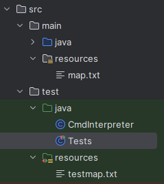
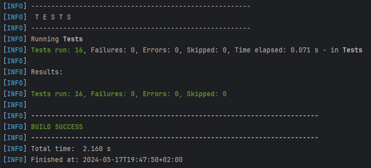
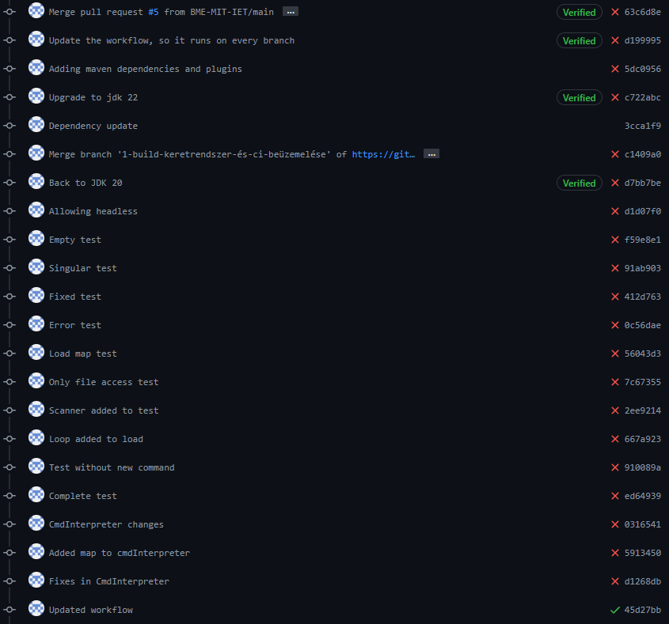

# Maven build keretrendszer, CI (GitHub Actions) beüzemelése

## A feladat részei
A megvalósítandó feladat az alábbi részekre lett felbontva:
- Maven keretrendszer hozzáadása a projekthez
- Teszteléshez szükséges osztály hozzáadása a projekthez, osztály modernizálása
- Tesztesetek létrehozása
- Github workflow létrehozása, tesztelése

## Maven keretrendszer hozzáadása a projekthez
A keretrendszer hozzáadása egy meglehetősen zökkenőmentes folyamat volt. A projekt forrásfájljai átrendezésre kerültek, a gyökérbe ömlesztett java fájlok áthelyezésre kerültek a (src/) main/java, illetve test/java mappákba. A pályát és a tesztpályát generáló szöveges fájlok a (src/) main/resources és test/resources mappákba lettek elkülönítve a forrásfájloktól. A Main osztály pálya elérése frissítve az új struktúrának megfelelően.

## Teszteléshez szükséges osztály hozzáadása a projekthez, osztály modernizálása
Ezen feladatrész megvalósítása az elképzelésekkel ellentétben meglehetősen komplikált volt. A projekt egy korábbi verziója rendelkezett egy tesztelést elősegítő, utasítást interpretáló osztállyal, amelynek segítségével lehetőség volt szöveges parancsokkal teszteket végrehajtani, amelynek eredménye a standard kimeneten jelent meg. Annak érdekében, hogy a projekt minden részét könnyedén lehessen tesztelni, ismét implementáltam a **CmdInterpreter** osztályt. Ez az osztály sajnos számos hibával rendelkezett az elavultsága miatt. Ennek következtében számos parancson belül konstruktorokat kellett újraparaméterezni, függvényeket kiegészíteni, hibákat javítani. Ezen felül az osztály a **Main** osztály statikus tagváltozóira referált, mivel az interpreter még a projekt egy olyan verziójában lett kialakítva, ahol még nem létezett grafikus felület, a **Main** osztály volt a tesztosztály. Ezen probléma feloldása érdekében a statikus tagváltozók a **CmdInterpreter** osztály privát tagváltozói lettek.

## Tesztesetek létrehozása
A tesztelés a **JUnit** keretrendszer segítségével lett megvalósítva. A szükséges függőségek beimportálása után létrehoztam a **Tests** osztályt, amelyben az egységtesztek kerültek elhelyezésre. A tesztek logikai alapját a projekt korábbi verziója adta, ahol felhasználó vezérelt, manuális "tesztelésre" volt lehetőség (a program a futás eredményét szövegesen a standard kimenetre írta ki). Ezen tesztlehetőség alapján alakítottam ki az aktuális projekt automatizált tesztjeit, amelyek **Assertions** segítségével ellenőrzik a futás eredményét. 

> A teszesetek létrehozása és kiértékelése során kiderült, hogy a
> projekt tesztpályája hibásan lett kialakítva, rosszul voltak az összeköttetések megadva.

Ezen hibák javítása után a tesztesetek ellenőrzése a **SureFire** plugin segítségével is megvalósult.

## Github workflow létrehozása, tesztelése
A Github CI a **Java CI with Maven** sablon alapján lett kialakítva. A sablon módosításva lett két helyen: 

 - A main ág helyett minden ág eseményei során le fog futni az automatizált ellenőrzés
 - Az opcionális függőségi gráf frissítő szolgáltatás törlésre került

A munkafolyamat legnagyobb problémáját a fentiekben említett main osztályra történő referálás miatti hibaüzenetek okozták.

## Eredmény
A feladatnak köszönhetően a projekt a **Maven keretrendszert** implementálja, ezzel lehetővé téve a projekt hatékony tesztelését. A **Github Workflow** megvalósításával megkönnyítettem a többi feladat megvalósítását (és a jövőbeli fejlesztések implementálását), a módosítások végrehajtása után nem kell mindenkinek manuálisan tesztelnie, a tesztesetek automatikusan kiértékelődnek **push** és **pull request** események során.

## Tanulság
A feladat megvalósítása során egyértelművé vált, hogy a projekt elején érdemes lett volna a **Maven** keretrendszert bevezetni, ezzel megkönnyítve a későbbi munkákat. A projekt fejlesztése során mindig naprakészen kellett volna tartani a **CmdInterpreter** osztályt és a teszteket, hogy elkerüljük az elavulásból eredő jövőbeli problémákat.
