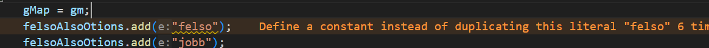

# Manuális kód átvizsgálás, statikus analízis

## A feladat leírása
A feladatot a következő lépések mentén valósítottuk meg:
- Hibák kigyűjtése SonarLint és ErrorLens segítségével
- Hibák szűrése fontosság szerint
- A kiszűrt és azonosított híbák kijavítása, változtatások publikálása
## Feladatmegosztás
A feladat végzése közben, mivel ketten egy időben csináltuk, folyamatosan beszéltünk egymással egy Discord hívásban. Ennek következményeként nagyon hatékonyan tudtuk a munkát felosztani, a feladattal párhuzamosan haladni és az esetleges merge-conflictokat elkerülni. Általánosságban egy class-t egy ember javított ki, ha elakadt a másiktól kért segítséget.
## Hibák kigyűjtése
A VSCode SonarLint és ErrorLens bővítményeivel először is átvizsgáltuk a kódbázist és megnéztük milyen hibákat talál a statikus analízis eszköz. Ezután kigyűjtöttük azokat, amelyek kijavítása nem triviális. Itt a csapattal közösen egyeztünk meg a kijavítandó hibákban. A statikus analízis futtatása során a következő hibákat vettük figyelembe:
- Save and reuse random
- Refactor monster class
- Refactor method to reduce complexity
- Remove code duplications
- és más kisebb javítások (olvashatóság, formai szabványok követése, szemantikai és logikai javítások)

Egy SonarLint és ErrorLens bővítményekkel megnyitott file egy sora ami hibás:

A továbbiakban a fentebb említett hibákat fogjuk részletesebben bemutatni.

## Save and reuse random
A hibát azért választottuk, mert a hiba kijavításának mellőzése komoly biztonsági hibákat idézhet elő. A hiba a `Cistern.java`, `Pump.java` és `Pipe.java` fájlokban volt. Megoldása egyszerű volt, hiszen csak az újrahasznált változókat kellett osztályonként egyszer példányosítani egy-egy privát tagváltozóként.

## Refactor monster class
A projektben a `Main.java` osztály isten osztálynak lett jelölve a statikus analízis során, aminek oka az osztály függőségeinek száma volt.

A problémát azonban nem csak a függőségek számának irányából közelítettük meg, hanem inkább a felelősségek szempontjából. Az osztály fő célja a játék kezdőállapotának beállítása és a játékmenet elkezdése, azonban az említett osztály végezte az elemek kirajzolását is.

A hiba orvoslásának érdekében létrehoztunk egy `Renderer.java` osztályt, ahova átkerült a kirajzoláshoz szükséges funkcionalítás. Habár így a `Main` class-ban eggyel több függőséget lett, így is sikerült annak számát összességében csökkenteni, ezzel is biztosítva az olvashatóságot és a SOLID elvek betartását.

## Refactor method to reduce complexity
A következő classok következő metódusainak komplexitását tudtuk csökkenteni:
- `MyFrame.java` -> drawLines method
- `Active.java` -> PipeRelocation method
- `GraphicsPipe.java` -> update method
- `GameKeyListener.java` -> keyReleased method
- `Pump.java` -> Insert method
A metódusok komplexitását általában egyszerű refaktorálással tudtuk csökkenteni, viszont néhány helyen át kellett írnunk a logikát is. Emellett itt még több más, a SonarLint által nem jelzett logikai hibát javítottunk ki.

## Remove code duplications
A `Pipe.java` ChangeState és AddPoint metódusait refaktoráltuk, hogy ne legyen benne kódduplikáció. Ezt mindkét metódusban a logika átírásával oldottuk meg.

## Kisebb javítások
Ezek a javítások általában nem voltak elég nagyméretűek, komplexek és fontosak, hogy külön mindegyikre kitérjünk. Az itt elvégzett javítások között van például: a nem használt importok kitörlése, behúzás javítása, kód olvashatóbbá tétele a kód formájának megváltoztatásával. Ezek a változtatások is javítottak a kód és a projekt minőségén.

## Összegzés, tanulságok

A feladat elvégzésével határozottan sikerült a kód minőségén és olvashatóságán javítani, ezzel bizonyítva a statikus analízis módszerek használatának fontosságát. A feladat során betekintést kaphattunk komplexebb problémák csoportos javításába és a csapatmunka mikéntjébe.
